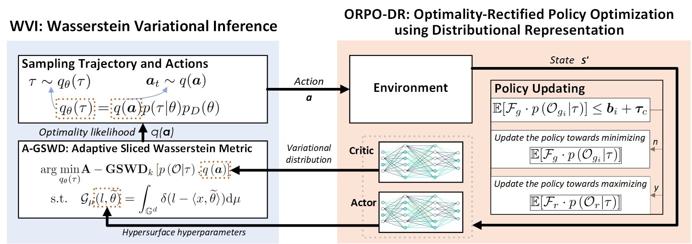

<h1 align="center">Probabilistic Constrained Reinforcement Learning with Formal Interpretability</h1>

    <a href="https://alex-yanranwang.github.io/">Yanran Wang</a>*&nbsp;&nbsp;&nbsp;&nbsp;
    <a href="https://bruceqqc.github.io/">Qiuchen (Bruce) Qian</a>&nbsp;&nbsp;&nbsp;&nbsp;
    <a href="https://profiles.imperial.ac.uk/david.boyle">David Boyle</a>&nbsp;&nbsp;&nbsp;&nbsp;&nbsp;&nbsp;&nbsp;&nbsp;

    *Corresponding Author&emsp;&emsp;&emsp;

    Systems and Algorithms Lab, Imperial College London, United Kingdom.&emsp;&emsp;&emsp;

    International Conference on Machine Learning (ICML) 2024, Vienna, Austria

    <a href="https://arxiv.org/abs/2307.07084">arXiv</a> &nbsp;&nbsp;
    <a href="https://proceedings.mlr.press/v235/wang24bf.html">Paper</a> &nbsp;&nbsp;
    <a href="https://www.youtube.com/watch?v=Auatih9Kxbw">Video</a> &nbsp;&nbsp;
    <a href="https://alex-yanranwang.github.io/AWaVO.html">Project Page</a>

  

## TODOs
- [ ] 📣 ORPO-DR and WVI code (in C++&Python) will be soon under the folder [AWaVO/](AWaVO/).
- [ ] 📣 Toturial of the practical quadrotor implementation will be released soon!

## Abstract

Reinforcement learning can provide effective reasoning for sequential decision-making problems with variable dynamics. Such reasoning in practical implementation, however, poses a persistent challenge in interpreting the reward function and the corresponding optimal policy. Consequently, representing sequential decision-making problems as probabilistic inference can have considerable value, as, in principle, the inference offers diverse and powerful mathematical tools to infer the stochastic dynamics whilst suggesting a probabilistic interpretation of policy optimization. In this study, we propose a novel Adaptive Wasserstein Variational Optimization, namely AWaVO, to tackle these interpretability challenges. Our approach uses formal methods to achieve the interpretability for convergence guarantee, training transparency, and intrinsic decision-interpretation. To demonstrate its practicality, we showcase guaranteed interpretability with a global convergence rate $\Theta(1/\sqrt{T})$ in simulation and in practical quadrotor tasks. In comparison with state-of-the-art benchmarks, including TRPO-IPO, PCPO, and CRPO, we empirically verify that AWaVO offers a reasonable trade-off between high performance and sufficient interpretability.

## Practical Implementation on a real quadrotor

  

## BibTeX

<pre><code>@InProceedings{wang24probabilistic,
    title = {Probabilistic Constrained Reinforcement Learning with Formal Interpretability},
    author = {Wang, Yanran and Qian, Qiuchen and Boyle, David},
    booktitle = {Proceedings of the 41st International Conference on Machine Learning},
    pages = {51303--51327},
    year = {2024},
    volume = {235},
    series = {Proceedings of Machine Learning Research},
    publisher = {PMLR}
  }</code></pre>

If you find this repository helpful, please cite our paper and give us a star!

## Acknowledgements

    This work was partially supported by NSF-UKRI [grant number NE/T011467/1]; and the Engineering and Physical Sciences Research Council [grant number EP/X040518/1].
  

